This guide will work with ChromeOS 129+.
**Note:** Device data is wiped. Enable developer mode.

### Steps to Enable Developer Mode

1. Turn off your Chromebook.
2. Press and hold the **ESC** (Button 1, row 1) and **Refresh** (Button 4, row 1) buttons.
3. Press the **Power** button to turn it on.
4. When the screen appears, press **Ctrl** (Button 1, row 6) + **D** (Button 4, row 4).
5. Press **Enter**. The device may reboot a few times; if you see the screen again, just press **Enter**.
6. Connect to Wi-Fi and log in with your Google account.

### Set Up Linux Development

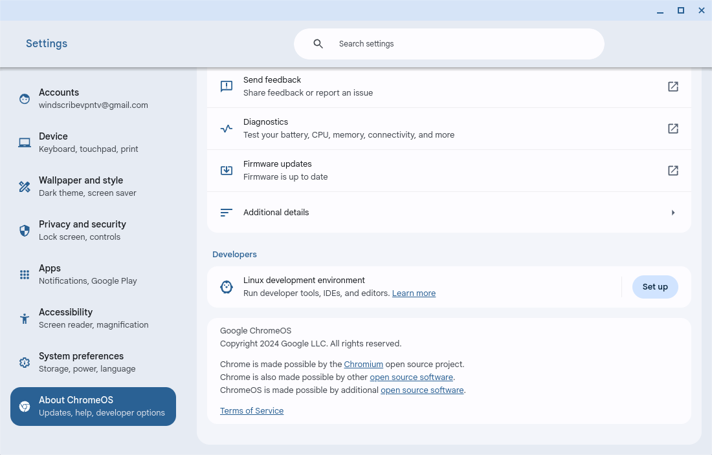
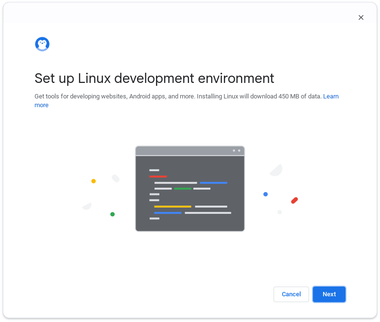
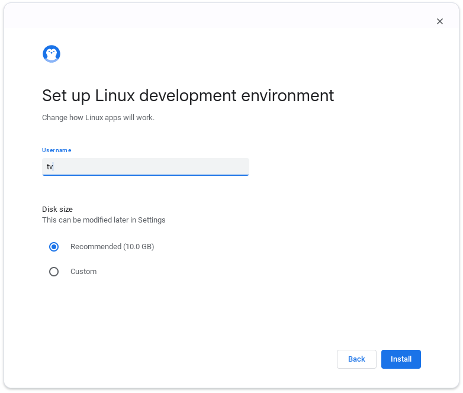
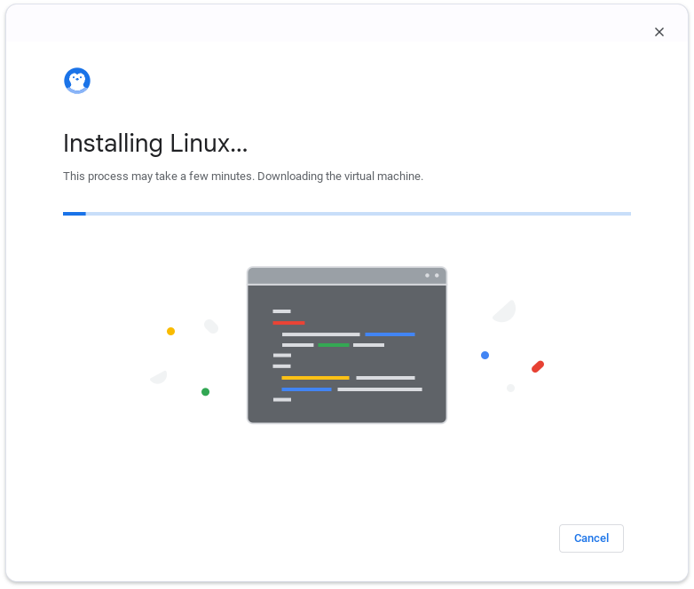
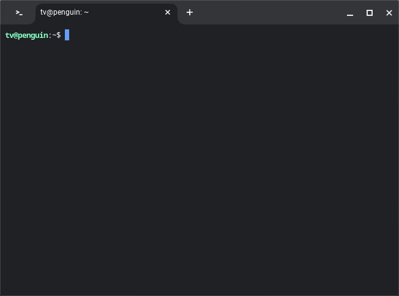

### Enable ADB Debugging

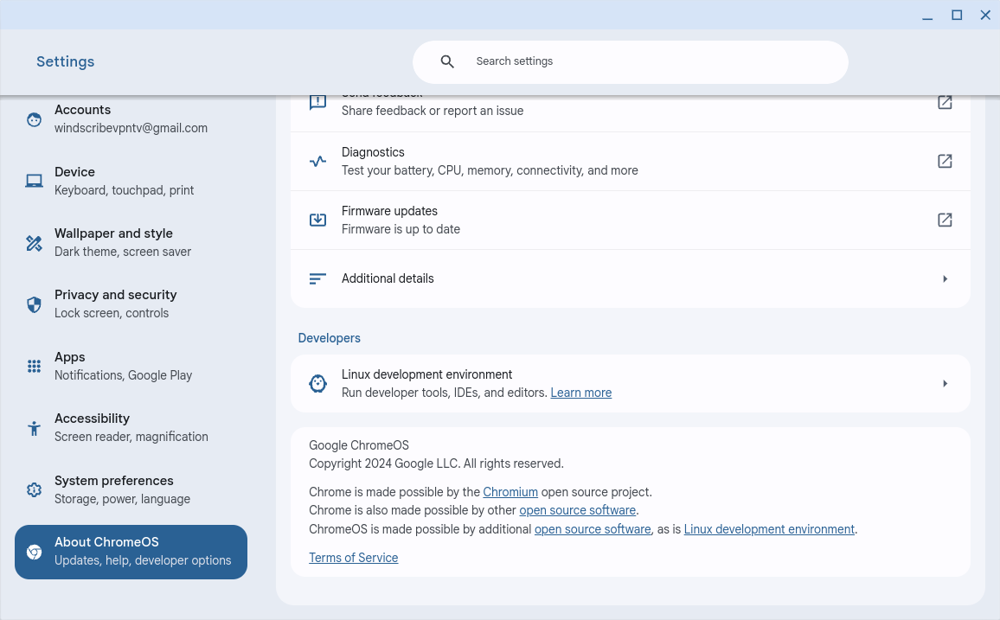
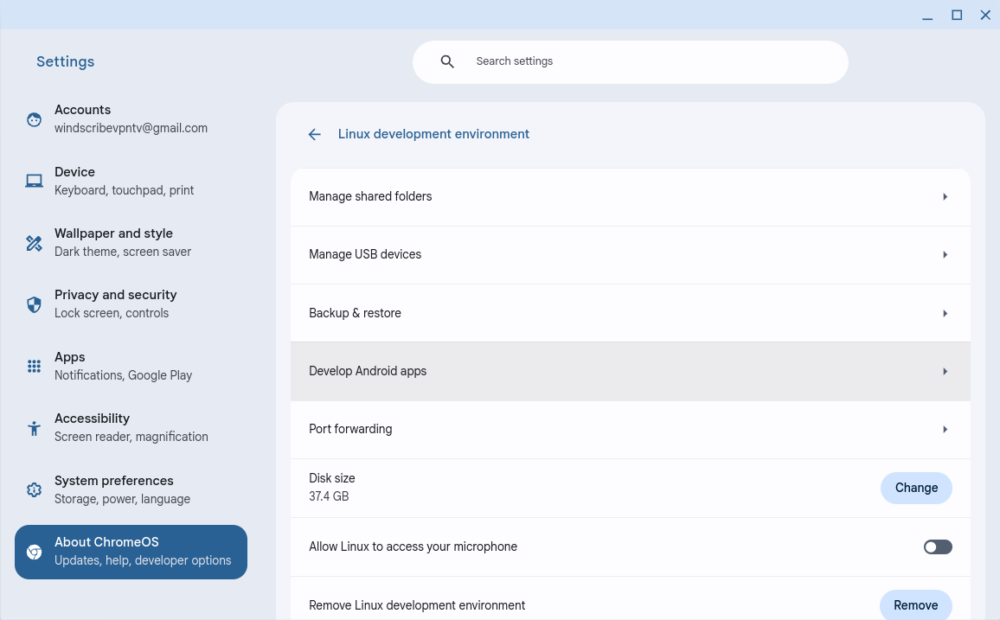
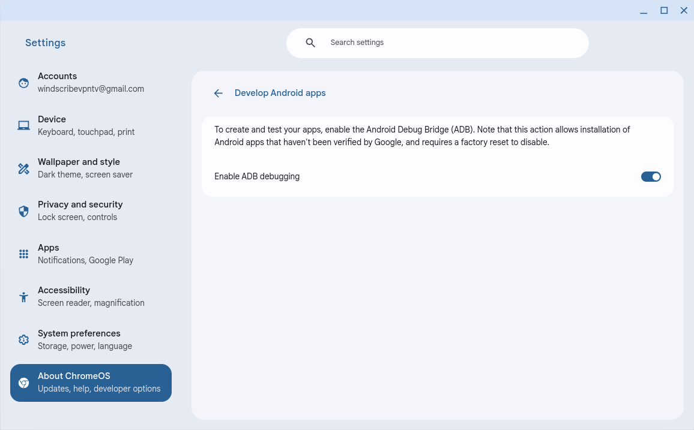

### Turn on Wi-Fi Debugging in Android Instance

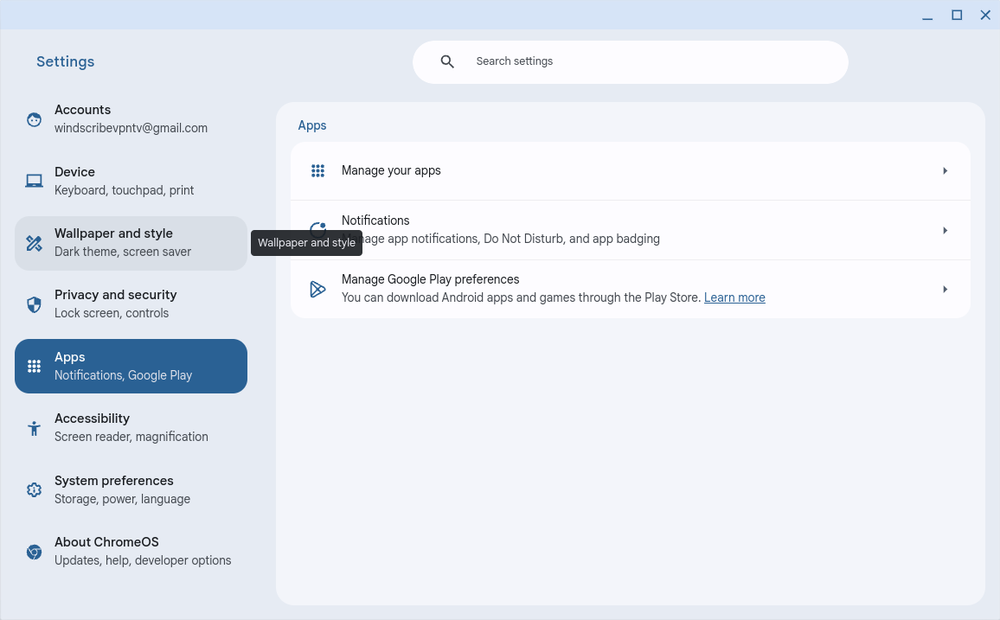
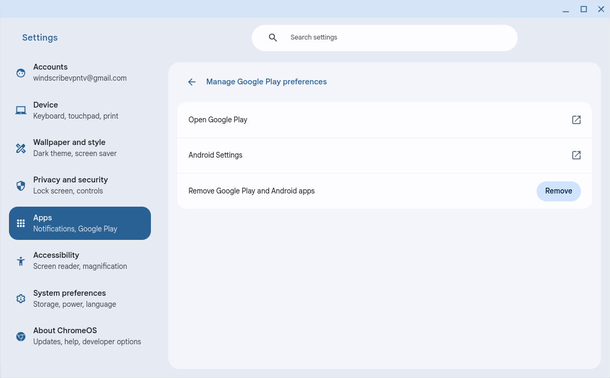
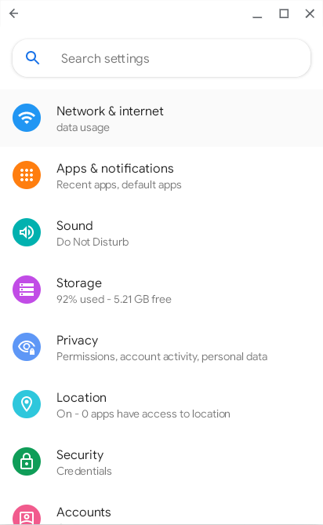

If not found, enable developer options by going to the About section and clicking on the Build Number 7 times.

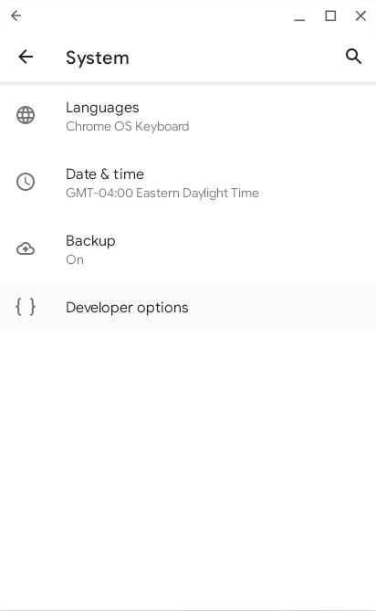
Turn on both ADB Debugging and Wi-Fi Debugging.

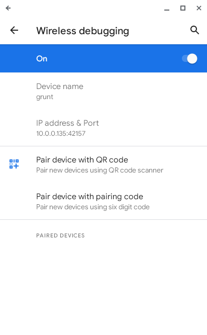

### Connect from Development Machine

1. Install and start ADB on your development machine.
2. Try to connect using the IP copied from the Android instance.
   
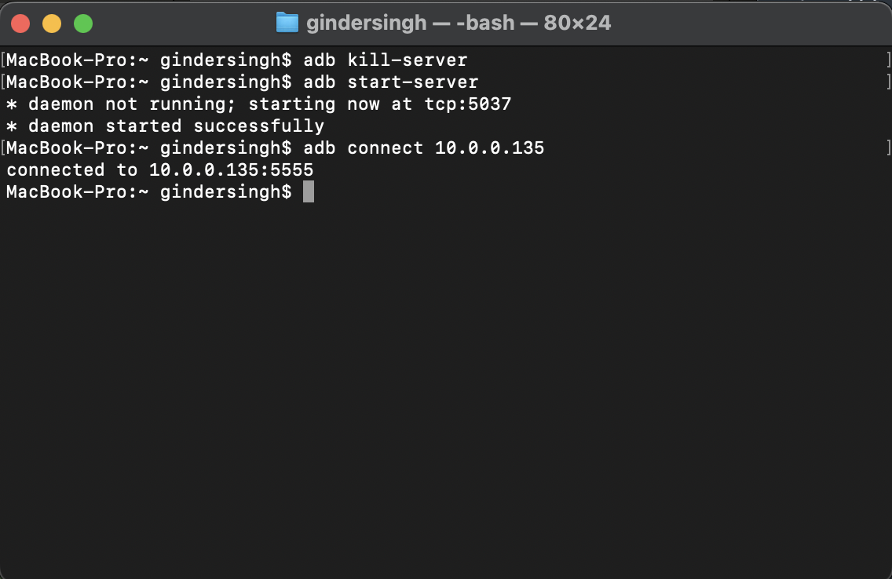
Allow the popup.

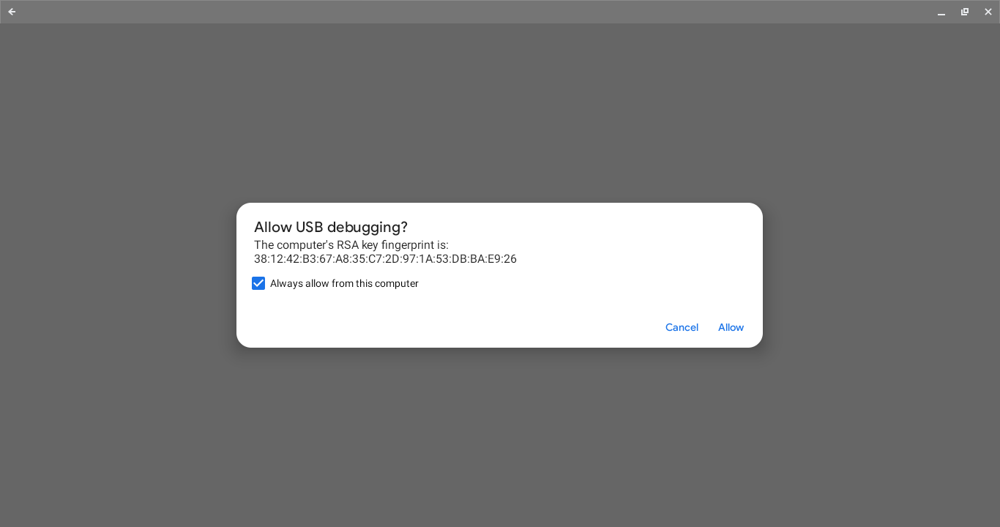

You should be good to go!
